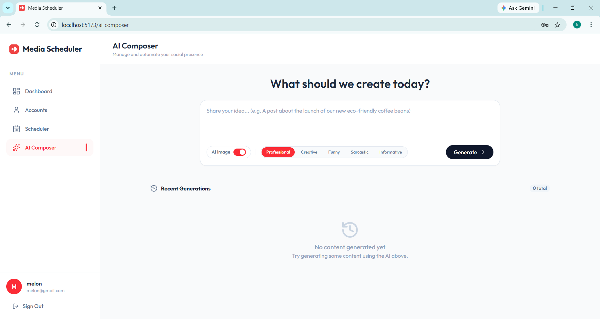
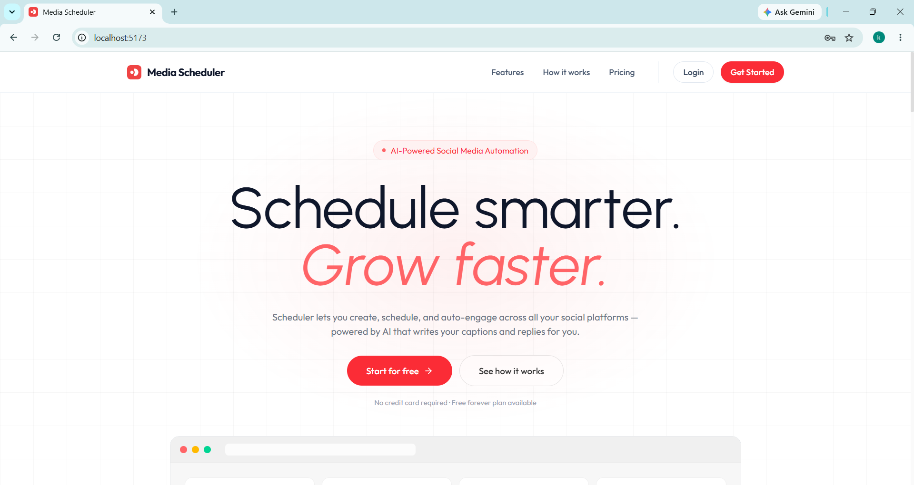
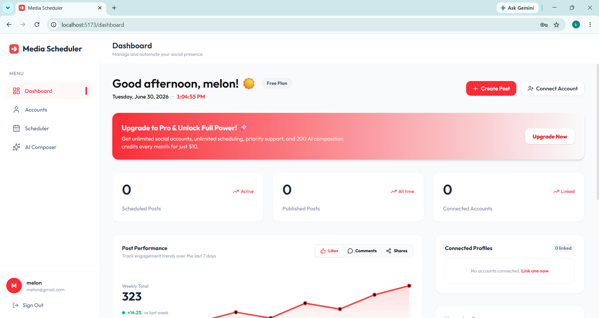

# 📅 Media Scheduler

An advanced, AI-powered social media scheduling and automation platform. This application allows users to compose posts using cutting-edge AI, generate matching images, link multiple social media accounts, and schedule posts to be published automatically in the background across platforms like Twitter, LinkedIn, Facebook, and Instagram.

---

## 📸 Screenshots

Here is a preview of the Media Scheduler interface:

### 1. Landing Page & Hero Section

*Featuring our dynamic, interactive music-card style carousel, brand-matching red gradients, and email signup form.*

### 2. Analytics Dashboard

*Includes real-time clock, dynamic greeting, performance stats, custom SVG Area Chart, connected profiles, and upcoming queue.*

### 3. AI Composer & Generation

*Compose posts using OpenRouter's AI, generate matching images via Leonardo.ai, and view recent generations history.*

---

## 🚀 Key Features

*   **🤖 AI Post Composer**: Generate high-quality social media posts using OpenRouter's `owl-alpha` model, tailored to specific tones, with automatic hashtag generation.
*   **🎨 AI Image Generation**: Generate stunning, context-aware visuals for your posts using Leonardo.ai, with automatic hosting via Cloudinary.
*   **🔗 Unified Social Account Linking**: Connect and manage multiple social media profiles (LinkedIn, Twitter/X, Facebook, Instagram) in one place using the **Zernio API**.
*   **📅 Automated Background Scheduler**: Schedule posts for any future date/time. A background cron service continuously checks and publishes them automatically.
*   **📊 Interactive Analytics Dashboard**: Track recently published posts, schedule queues, and logs of all system activities.
*   **📈 Advanced SVG Performance Chart**: Interactive chart showing trends of Likes, Comments, and Shares over the last 7 days with dynamic tab switching.
*   **💳 Stripe Subscription Billing**: Integrated Stripe Checkout for Pro ($10/mo) and Agency ($20/mo) plans, with automatic payment verification and dashboard upgrades.
*   **✉️ Email Notification System**: Beautiful HTML emails sent via Nodemailer (Welcome, Post Scheduled, Account Linked, and Post Published confirmations).
*   **🖼️ Media Uploads**: Upload local images or videos directly to posts, stored securely in the cloud.

---

## 🛠️ Tech Stack

### Frontend
*   **Framework**: React (TypeScript) + Vite
*   **Styling**: Tailwind CSS (sleek, modern dark-themed UI with glassmorphic elements)
*   **Routing**: React Router DOM

### Backend
*   **Runtime**: Node.js (TypeScript) + Express
*   **Runner/Watcher**: `tsx` (TypeScript Execute) for fast ESM execution
*   **Database**: MongoDB Atlas (Cloud Cluster) + Mongoose
*   **Authentication**: JWT (JSON Web Tokens) + bcrypt (password hashing)
*   **API Integrations**:
    *   **Zernio SDK (`@zernio/node`)**: For unified social media publishing and profile connection.
    *   **Stripe SDK**: For subscription checkout and billing.
    *   **Nodemailer**: For HTML email notifications.
    *   **OpenRouter SDK**: To power text generation.
    *   **Leonardo.ai API**: For AI image generation.
    *   **Cloudinary**: For cloud media storage.
*   **Task Scheduling**: `node-cron` (running a background publishing worker every minute)

---

## 📂 Project Structure

```text
Media Sheduler/
├── client/                 # Frontend React Application
│   ├── src/
│   │   ├── assets/         # Icons, images, and static assets
│   │   ├── components/     # Reusable UI components (Sidebar, Navbar, Layout)
│   │   ├── context/        # App state context
│   │   ├── pages/          # Pages (Dashboard, Accounts, Scheduler, AI Composer, Login)
│   │   └── App.tsx         # App routing and entry
│   └── package.json
│
└── server/                 # Backend Node.js API & Services
    ├── config/             # DB, Cloudinary, Multer, and Zernio configurations
    ├── controllers/        # Request handlers (Auth, Accounts, Posts, Activity, Payments)
    ├── middlewares/        # Express Middlewares (JWT Authentication guard)
    ├── models/             # Mongoose schemas (User, Account, Post, ActivityLog, Generation)
    ├── routes/             # API Router endpoints (Auth, Accounts, Posts, Activity, Payments)
    ├── services/           # Background scheduler worker (node-cron) and Email service
    ├── server.ts           # Express application entry point
    └── package.json
```

---

## ⚙️ Getting Started

### Prerequisites
*   Node.js (v18+ recommended)
*   MongoDB Database (Local or MongoDB Atlas)

### Installation

1.  **Clone or navigate to the project directory**:
    ```bash
    cd "C:\Users\ASUS\Desktop\Media Sheduler"
    ```

2.  **Set up the Backend**:
    ```bash
    cd server
    npm install
    ```

3.  **Set up the Frontend**:
    ```bash
    cd ../client
    npm install
    ```

---

## 🔒 Environment Variables

Create a `.env` file inside the `server/` directory and populate it with your keys:

```env
PORT=3000
MONGODB_URI=your_mongodb_connection_string
JWT_SECRET=your_secure_jwt_signing_secret

# Social Media Integration (Zernio)
ZIO_API_KEY=your_zernio_api_key

# Stripe Billing Integration
STRIPE_SECRET_KEY=your_stripe_secret_key

# Email Notification Integration (SMTP)
EMAIL_USER=your_email_address
EMAIL_PASS=your_email_app_password
SMTP_HOST=smtp.gmail.com
SMTP_PORT=587

# AI Integrations
OPENROUTER_API_KEY=your_openrouter_api_key
LEONARDO_API_KEY=your_leonardo_ai_key

# Media Cloud Storage (Cloudinary)
CLOUDINARY_CLOUD_NAME=your_cloudinary_cloud_name
CLOUDINARY_API_KEY=your_cloudinary_api_key
CLOUDINARY_API_SECRET=your_cloudinary_api_secret
```

---

## 🏃‍♂️ Running the Application

### 1. Start the Backend Server
From the `server/` directory:
```bash
npm run server
```
*Runs the server at `http://localhost:3000` with hot-reloading using `tsx watch`.*

### 2. Start the Frontend Development Server
From the `client/` directory:
```bash
npm run dev
```
*Runs the frontend at `http://localhost:5173/`.*

---

## 🔌 API Endpoints

### 🔐 Authentication
*   `POST /api/auth/register` - Register a new user.
*   `POST /api/auth/login` - Authenticate user and receive a JWT.

### 🔗 Social Accounts
*   `GET /api/auth/:platform/url` - Get the Zernio OAuth link to connect a platform.
*   `GET /api/auth/sync` - Sync connected social profiles from Zernio to the local database.
*   `GET /api/accounts` - Fetch all connected accounts for the logged-in user.
*   `DELETE /api/accounts/:id` - Disconnect and delete a social account.

### 📝 Posts & AI Generation
*   `POST /api/posts/generate` - Generate post text (OpenRouter) and optional images (Leonardo.ai).
*   `GET /api/posts/generations` - Fetch history of AI generations.
*   `POST /api/posts` - Schedule a new post (supports local file upload via Multer).
*   `GET /api/posts` - Get all posts (scheduled, published, failed) for the user.

### 💳 Stripe Subscription Billing
*   `POST /api/payment/create-checkout-session` - Create a Stripe checkout session for Pro/Agency.
*   `POST /api/payment/verify-session` - Verify checkout session and upgrade user plan.

### 📊 Activity Logs
*   `GET /api/activity` - Get the recent activity logs for the dashboard.
